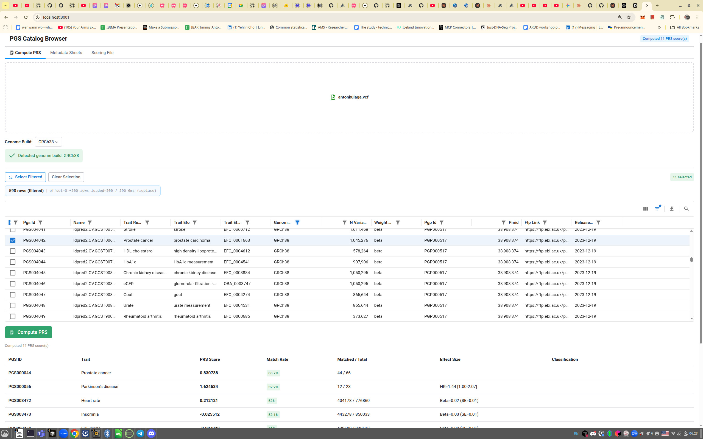

# just-prs

[](https://pypi.org/project/just-prs/)
[](https://pypi.org/project/prs-ui/)
[](https://www.python.org/downloads/)

A [Polars](https://pola.rs/)-bio based tool to compute **Polygenic Risk Scores (PRS)** from the [PGS Catalog](https://www.pgscatalog.org/).

## Project Structure

This is a **uv workspace** with three subprojects:

| Package | Directory | Description |
|---|---|---|
| **just-prs** | `just-prs/` | Core library: PRS computation, PGS Catalog client, VCF normalization, scoring files. Published to PyPI. |
| **prs-ui** | `prs-ui/` | Reflex web UI for interactive PRS computation. Published to PyPI. |
| **prs-pipeline** | `prs-pipeline/` | Dagster pipeline for computing reference distributions from the 1000G panel. |

The workspace root is a non-published wrapper that depends on all three subprojects and provides convenience scripts (`uv run ui`, `uv run pipeline`).

## Web UI

An interactive [Reflex](https://reflex.dev/) web application for browsing PGS Catalog data and computing PRS scores.



### Setup

```bash
# From the workspace root — install all packages (including prs-ui)
uv sync --all-packages

# Launch the UI (shortcut defined in pyproject.toml)
uv run ui

# Or equivalently, from the prs-ui directory:
cd prs-ui
uv run reflex run
```

The UI opens at http://localhost:3000 with three tabs:

### Compute PRS (default tab)

1. **Upload a VCF** — drag-and-drop or browse; genome build is auto-detected from `##reference` and `##contig` headers. VCF is normalized (chr prefix stripped, genotype computed, quality filtered) with a visible progress bar and a green callout on completion showing variant count
2. **Load Scores** — fetches PGS Catalog scores metadata, pre-filtered by detected (or manually selected) genome build
3. **Select scores** — use checkboxes to pick individual scores, or "Select Filtered" to select everything matching the current filter
4. **Compute** — click **Compute PRS** to run PRS for each selected score. A progress bar tracks completion across scores. Results table shows PRS score, AUROC (model accuracy), quality assessment, evaluation population/ancestry, match rate, matched/total variants, and effect sizes. Each result includes an interpretation card with a plain-English summary of model quality
5. **Download CSV** — export all computed results to a CSV file via the **Download CSV** button above the results table

### Metadata Sheets

Browse all 7 PGS Catalog metadata sheets in a MUI DataGrid with filtering and sorting. Select rows and download their scoring files with **Download Selected**.

### Scoring File

Stream any harmonized scoring file by PGS ID directly from EBI FTP and view it in the grid.

| Environment variable | Default | Description |
|---------------------|---------|-------------|
| `PRS_CACHE_DIR` | OS-dependent (via `platformdirs`) | Root directory for cached metadata and scoring files |

## Features

- **`PRSCatalog`** — search scores, compute PRS, and look up evaluation performance using cleaned bulk metadata (no REST API calls needed)
- **Reusable Reflex UI components** — `prs_section()` and sub-components (`prs_scores_selector`, `prs_results_table`, etc.) can be embedded in any Reflex app via `PRSComputeStateMixin`
- **VCF normalization** — `normalize_vcf()` strips chr prefix, renames id→rsid, computes genotype from GT, applies configurable quality filters (FILTER, DP, QUAL), warns on chrY for females, and writes zstd-compressed Parquet
- **Quality assessment** — `just_prs.quality` provides pure-logic helpers (`classify_model_quality`, `interpret_prs_result`, `format_effect_size`, `format_classification`) usable from any UI or script
- **CSV export** — download computed PRS results as CSV from the web UI or programmatically
- **Cleanup pipeline** — normalizes genome builds, renames columns to snake_case, parses performance metrics into structured numeric fields
- **HuggingFace sync** — cleaned metadata parquets published to [just-dna-seq/polygenic_risk_scores](https://huggingface.co/datasets/just-dna-seq/polygenic_risk_scores) and auto-downloaded on first use
- **Bulk download** the entire PGS Catalog metadata (~5,000+ scores) via EBI FTP
- Compute PRS for one or many scores against a VCF file
- All data saved as **Parquet** for fast downstream analysis with Polars
- [Validated against PLINK2](docs/validation.md) with floating-point precision agreement

## Installation

Requires Python >= 3.14. Uses [uv](https://github.com/astral-sh/uv) for dependency management.

**From PyPI:**

```bash
pip install just-prs
```

**From source (development):**

```bash
git clone https://github.com/antonkulaga/just-prs
cd just-prs
uv sync --all-packages   # installs all three subprojects + dev deps
```

To install only the core library without UI or pipeline: `cd just-prs/just-prs && uv sync`.

The CLI is available as both `just-prs` and `prs`.

## Quick Start

### CLI

```bash
# Compute PRS for a single score
prs compute --vcf sample.vcf.gz --pgs-id PGS000001

# Multiple scores at once
prs compute --vcf sample.vcf.gz --pgs-id PGS000001,PGS000002,PGS000003

# Normalize a VCF to Parquet (strip chr prefix, compute genotype, quality filter)
prs normalize --vcf sample.vcf.gz --pass-filters "PASS,." --min-depth 10

# Search the catalog
prs catalog scores search --term "breast cancer"
```

### Python

```python
import polars as pl
from just_prs import PRSCatalog, normalize_vcf, VcfFilterConfig
from just_prs.prs import compute_prs
from pathlib import Path

catalog = PRSCatalog()

# 1. Normalize VCF to Parquet (recommended as a first step)
config = VcfFilterConfig(pass_filters=["PASS", "."], min_depth=10)
parquet_path = normalize_vcf(Path("sample.vcf.gz"), Path("sample.parquet"), config=config)

# 2. Load as a LazyFrame — memory-efficient, reusable across multiple PRS computations
genotypes_lf = pl.scan_parquet(parquet_path)

# Search for scores
results = catalog.search("type 2 diabetes", genome_build="GRCh38").collect()

# Compute PRS using a LazyFrame (avoids re-reading the VCF for each score)
result = compute_prs(
    vcf_path="sample.vcf.gz",
    scoring_file="PGS000001",
    genome_build="GRCh38",
    genotypes_lf=genotypes_lf,
)
print(f"Score: {result.score:.6f}, Match rate: {result.match_rate:.1%}")

# Batch computation
results = catalog.compute_prs_batch(
    vcf_path=Path("sample.vcf.gz"),
    pgs_ids=["PGS000001", "PGS000002", "PGS000003"],
)

# Look up best evaluation performance for a score
best = catalog.best_performance(pgs_id="PGS000001").collect()
```

## Embedding PRS UI in Another Reflex App

The PRS computation UI is packaged as reusable [Reflex](https://reflex.dev/) components. Install `prs-ui` (which pulls in `just-prs` automatically), mix `PRSComputeStateMixin` into your state, provide a normalized genotypes LazyFrame, and render the section:

```python
import polars as pl
import reflex as rx
from reflex_mui_datagrid import LazyFrameGridMixin
from prs_ui import PRSComputeStateMixin, prs_section


class MyAppState(rx.State):
    genome_build: str = "GRCh38"
    cache_dir: str = ""
    status_message: str = ""


class PRSState(PRSComputeStateMixin, LazyFrameGridMixin, MyAppState):
    def load_genotypes(self, parquet_path: str) -> None:
        lf = pl.scan_parquet(parquet_path)
        self.set_prs_genotypes_lf(lf)
        self.prs_genotypes_path = parquet_path


def prs_page() -> rx.Component:
    return prs_section(PRSState)
```

The preferred input method is a polars LazyFrame via `set_prs_genotypes_lf()` -- this is memory-efficient and avoids re-reading VCF files on each computation. Individual sub-components (`prs_scores_selector`, `prs_results_table`, `prs_compute_button`, `prs_progress_section`, `prs_build_selector`) can be used independently for custom layouts.

## Testing

The project includes an extensive integration test suite that runs against real genomic data and external tools -- no mocked data or synthetic fixtures. All tests are reproducible on any Linux, macOS, or Windows machine.

```bash
uv run pytest just-prs/tests/ -v
```

| Test suite | What it validates | Data source |
|---|---|---|
| `test_plink.py` | PRS scores match [PLINK2](https://www.cog-genomics.org/plink/2.0/) `--score` within floating-point precision for 5 GRCh38 scores | Real whole-genome VCF from Zenodo; PLINK2 auto-downloaded |
| `test_percentile.py` | Theoretical mean/SD from allele frequencies, percentile computation, and cross-validation against PLINK2 for 5 scores with allele frequency data | Real PGS scoring files with `allelefrequency_effect` |
| `test_prs.py` | End-to-end PRS computation (single and batch) on a real VCF | Zenodo test VCF |
| `test_cleanup.py` | Full cleanup pipeline: column renaming, genome build normalization, metric string parsing, performance flattening, `PRSCatalog` search/percentile on live catalog data | Real PGS Catalog bulk metadata (~5,000+ scores) via EBI FTP |
| `test_scoring.py` | Scoring file download, parsing, and caching | Real PGS000001 harmonized scoring file |
| `test_catalog.py` | REST API client: score lookup, trait search, download URL resolution | Live PGS Catalog REST API |

Key properties of the test suite:

- **PLINK2 cross-validation** -- scores are compared against the gold-standard PLINK2 `--score` command with relative differences below 5e-7 ([details](docs/validation.md))
- **Real data throughout** -- test VCF auto-downloaded from Zenodo, PLINK2 binary auto-downloaded for the host platform, scoring files fetched from EBI FTP
- **Percentile verification** -- theoretical statistics computed from allele frequencies are validated against manual row-by-row computation, and percentiles are checked for mathematical consistency (CDF symmetry, known quantiles)
- **No mocking** -- all tests run real pipelines against real data to catch integration issues

## Documentation

- [CLI Reference](docs/cli.md) — full command-line usage for `prs compute`, `prs normalize`, `prs catalog`, and bulk downloads
- [Python API](docs/python-api.md) — `PRSCatalog`, VCF normalization, FTP downloads, REST client, cleanup pipeline, HuggingFace sync
- [PLINK2 Validation](docs/validation.md) — accuracy benchmarks against PLINK2 `--score`
- [Cleanup Pipeline](docs/cleanup-pipeline.md) — genome build normalization, column renaming, metric parsing

## Data sources

- PGS Catalog REST API: <https://www.pgscatalog.org/rest/>
- EBI FTP bulk downloads: <https://ftp.ebi.ac.uk/pub/databases/spot/pgs/>
- PGS Catalog download documentation: <https://www.pgscatalog.org/downloads/>
- Cleaned metadata parquets on HuggingFace: <https://huggingface.co/datasets/just-dna-seq/polygenic_risk_scores>
