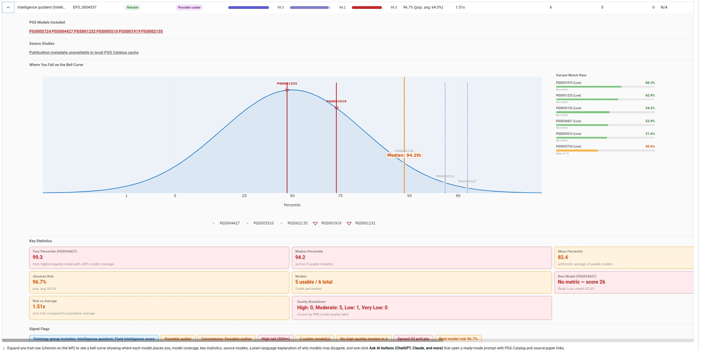

# just-prs: The Polygenic Risk Score (PRS) Toolbox

[](https://pypi.org/project/just-prs/)
[](https://pypi.org/project/prs-ui/)
[](https://www.python.org/downloads/)
[](#research-use-only-interpreting-prs-results)
[](#research-use-only-interpreting-prs-results)
[](https://github.com/dna-seq/just-prs-mcp)
[](#web-ui)

`just-prs` is a Polygenic Risk Score (PRS) toolbox with access to **5,000+
published scoring models** from the
[PGS Catalog](https://www.pgscatalog.org/), covering thousands of traits and
diseases. You can also bring **your own scoring files** — the Python API accepts
any local `.txt.gz` or `.parquet` file with the standard columns, so you are not
limited to what is in the catalog. Normalize VCFs, search scores and traits,
compute PRS values, compare them with reference populations, and estimate
absolute disease risk. When a result is hard to interpret, ask an AI assistant
— `just-prs` integrates with
**Claude, ChatGPT, Cursor, Codex, and other agents** via
[MCP](https://github.com/dna-seq/just-prs-mcp), so you can compute a score and
have it explained in plain language in the same conversation.

Most PRS tools either hide the mess behind a single curated score or dump raw
catalog data with no guidance. `just-prs` does neither — it exposes **every
available model** for a trait and gives you the tools to decide which ones to
trust: synthetic and combined quality scores, discrimination-tier labels,
variant match rates, reference-panel percentiles across ancestry groups,
absolute-risk estimates with confidence context, and trait-level summaries that
show where models agree and where they don't. The goal is honesty, not
simplicity theater: PRS science is noisy, and you deserve to see that noise
together with the metrics that help you navigate it.

Many human traits and common diseases, such as type 2 diabetes, coronary artery
disease, height, and longevity, are **polygenic**: they are influenced by
thousands of small genetic effects across the genome rather than one single
"faulty gene". A PRS adds those small effects together and places your result
relative to a reference population. It is not a diagnosis and does not guarantee
an outcome; it is a way to visualize inherited predisposition and, where enough
evidence is available, translate a percentile into an absolute-risk estimate.

You can use it three ways:

- **Open it in the browser** with the `prs-ui` web app: upload a VCF, browse
  traits, compute scores, and inspect bell curves, absolute-risk estimates, and
  plain-English explanations.
- **Use it with Claude, Cursor, Codex, Antigravity, or other AI agents** through
  [just-prs-mcp](https://github.com/dna-seq/just-prs-mcp): ask an agent to
  download a public genome, normalize it, search the catalog, compute PRS, and
  explain the result in chat.
- **Run it from the CLI or Python** for scripts, notebooks, and pipelines:
  Polars/DuckDB-backed VCF normalization, scoring-file parsing, variant matching,
  batch scoring, and reference-panel workflows.

## Contents

- [Web UI](#web-ui)
- [Use with Claude, Cursor, Codex, Antigravity, or other agents](#use-with-claude-cursor-codex-antigravity-or-other-agents)
- [CLI and Python](#cli-and-python)
- [Test Genomes (Quick Play)](#test-genomes-quick-play)
- [Research Use Only: Interpreting PRS Results](#research-use-only-interpreting-prs-results)
- [Installation](#installation)
- [Features](#features)
- [Why not PLINK2?](#why-not-plink2)
- [Project Structure](#project-structure)
- [Embedding PRS UI in Another Reflex App](#embedding-prs-ui-in-another-reflex-app)
- [Testing](#testing)
- [Documentation](#documentation)
- [Data sources](#data-sources)

## Web UI

Prefer a browser? The [Reflex](https://reflex.dev/) app lets you upload a VCF,
browse PGS Catalog traits and scores, compute PRS results, and inspect bell
curves, absolute-risk context, and plain-English interpretations.


### Setup

```bash
# From the workspace root — install all packages (including prs-ui)
uv sync --all-packages

# Launch the UI (shortcut defined in pyproject.toml)
uv run ui
```

The UI opens at http://localhost:3000 with three tabs: **Compute PRS**,
**Metadata Sheets**, and **Scoring File**.

### Compute PRS (default tab)

A single workbench has one shared genotype source feeding two selection modes:

1. **Upload a VCF once** — the app detects the genome build, normalizes the VCF,
   caches the normalized Parquet, and feeds both selection modes.
2. **Select by PRS or by Trait** — compute individual PGS IDs, or pick a whole
   trait such as type 2 diabetes and aggregate all associated PGS models into a
   consensus summary.
3. **Download CSV** — export computed results from the results table.

The metadata and scoring-file tabs are for browsing PGS Catalog sheets and
streaming harmonized scoring files by PGS ID.

## Use with Claude, Cursor, Codex, Antigravity, or other agents

The MCP server lives at
[github.com/dna-seq/just-prs-mcp](https://github.com/dna-seq/just-prs-mcp) and
is published as `just-prs-mcp`, so Claude Code, Cursor, Codex, Antigravity, and
other MCP-capable agents can launch it without cloning anything. This is a
first-class path for non-developers too: you can ask the assistant what you want
in plain language and let it call the PRS tools.

For Claude Code:

```bash
claude mcp add just-prs -- uvx just-prs-mcp@latest stdio
```

For Cursor, add this to `.cursor/mcp.json` in your project, or to your user MCP
configuration:

```json
{
  "mcpServers": {
    "just-prs": {
      "command": "uvx",
      "args": ["just-prs-mcp@latest", "stdio"],
      "env": {
        "PRS_MCP_MODE": "essentials"
      }
    }
  }
}
```

For Codex, use the equivalent MCP server configuration:

```toml
[mcp_servers.just-prs]
command = "uvx"
args = ["just-prs-mcp@latest", "stdio"]
```

For Antigravity or another MCP-capable assistant, add the same server command:
`uvx just-prs-mcp@latest stdio`.

Then ask your agent something like: "Download Anton's sample genome, normalize
it, and compute the PRS score for type 2 diabetes."

## Claude Code skill (slash command)

If you use [Claude Code](https://docs.anthropic.com/en/docs/claude-code) or
[Antigravity](https://antigravity.ai), `just-prs` includes a `/prs` skill
that teaches the assistant how to search the PGS Catalog, compute scores,
generate Altair charts, and interpret results — all through the CLI and Python
API, no MCP server needed.

The skill source lives at
[`docs/skills/prs/SKILL.md`](docs/skills/prs/SKILL.md) in the repo.

**Workspace-level** (for contributors who clone this repo):

```bash
mkdir -p .claude/skills/prs
ln -sf ../../../docs/skills/prs/SKILL.md .claude/skills/prs/SKILL.md
```

Then type `/prs BMI` or `/prs type 2 diabetes` in Claude Code to invoke it.

**Personal-level** (available in all your projects):

```bash
mkdir -p ~/.claude/skills/prs
curl -o ~/.claude/skills/prs/SKILL.md \
  https://raw.githubusercontent.com/dna-seq/just-prs/main/docs/skills/prs/SKILL.md
```

After this, `/prs` is available in every Claude Code session. The skill uses
`uvx just-prs` for CLI commands, so nothing needs to be pre-installed.

**Antigravity**: same as personal-level — copy the `SKILL.md` to
`~/.claude/skills/prs/` or to your Antigravity project's
`.claude/skills/prs/` directory.

**Skill vs MCP**: the `/prs` skill is a lightweight alternative to the MCP
server. It teaches Claude how to call the CLI and Python API directly, while the
MCP server exposes structured tool schemas with typed parameters. Use the skill
for quick interactive sessions; use MCP when you need programmatic tool
invocation from agents or multi-step pipelines. There is no one-click install
URL for skills — MCP remains the easiest path for external users.

## Visualization (charts)

Altair-based chart generation is built in — bell curves, multi-ancestry
overlays, trait-grouped scatter plots, and percentile strip charts.
HTML (interactive with tooltips) and JSON (Vega-Lite spec) export works out of
the box. For PNG/SVG raster export, install the `viz` extra:

```bash
pip install "just-prs[viz]"    # adds vl-convert-python for PNG/SVG
```

### CLI (`prs plot`)

Generate charts directly from the terminal. Reference distributions are loaded
from cache automatically (pulled from HuggingFace on first use).

All plot commands accept `--vcf` (a file path or alias) to auto-compute PRS and
plot in one step. See [VCF aliases](#vcf-aliases) below. PRS results are
**cached per (VCF, PGS ID, build, ancestry)** — repeated plotting is instant.
Use `--no-cache` to force recomputation.

Trait matching is **exact by default** (case-insensitive). If no exact match
is found, the command lists partial matches and exits. Use `--fuzzy` to
compute PRS for all partial matches.

```bash
# One-liner: compute + plot for a trait using a VCF alias
prs plot trait "type 1 diabetes" --vcf livia -o t1d.html --show-table
prs plot trait BMI --vcf anton -o bmi.html --show-table

# Fuzzy trait matching (substring)
prs plot trait thrombosis --vcf anton -o dvt.html --fuzzy --show-table

# Overlay all 5 population reference curves
prs plot trait BMI --vcf anton -o bmi.html --show-table --all-ancestries

# Or select specific populations
prs plot trait BMI --vcf anton -o bmi.html --ancestries EUR,AFR,EAS

# Single PGS bell curve for one ancestry
prs plot bell-curve PGS000001 -o bell.html
prs plot bell-curve PGS000001 -o bell.html -a AFR --user-score 0.274
prs plot bell-curve PGS000001 --vcf anton -o bell.html

# All five population curves overlaid (single PGS ID)
prs plot multi-ancestry PGS000001 -o multi.html
prs plot multi-ancestry PGS000001 --vcf livia -o multi.html
prs plot multi-ancestry PGS000001 -o multi.html --ancestries EUR,AFR,EAS

# Trait chart from pre-computed results JSON
prs plot trait "type 2 diabetes" -o t2d.html --results my_results.json

# Percentile strip chart (requires a JSON file with computed results)
prs plot strip results.json -o strip.html --title "My PRS Report"

# Force recompute (bypass result cache)
prs plot trait BMI --vcf anton -o bmi.html --no-cache
```

Output format is auto-detected from the file extension (`.png`, `.svg`, `.html`, `.json`).
PNG/SVG requires `just-prs[viz]`; HTML/JSON works out of the box.

### Python API (`just_prs.viz`)

Four chart functions are available:

| Function | What it shows |
|----------|--------------|
| `plot_prs_bell_curve` | Single model + ancestry bell curve with user score marker |
| `plot_prs_multi_ancestry` | Five population curves overlaid with user score line |
| `plot_trait_scores` | Trait-grouped: N(0,1) reference + per-model z-score dots colored by quality, optional summary table |
| `plot_prs_percentile_strip` | Horizontal strip with risk-colored bands and dots per score |

All functions accept `width` and `height` parameters. `plot_trait_scores` adds
`show_table=True` for a model details panel, `table_height` for sizing, and
`ancestries` for multi-population overlays.
Use `save_chart(chart, Path("output.png"))` to export — format is auto-detected
from the file extension (`.png`, `.svg`, `.html`, `.json`).

```python
from just_prs.viz import plot_trait_scores, save_chart
from pathlib import Path
import polars as pl

dists = pl.read_parquet("~/.cache/just-prs/percentiles/1000g_distributions.parquet")
quality = pl.read_parquet("~/.cache/just-prs/percentiles/1000g_quality.parquet")

chart = plot_trait_scores(
    "BMI", dists, quality_df=quality,
    user_results=my_results,        # list of dicts with pgs_id, score, match_rate
    height=150, show_table=True,    # compact bell curve + model table
)
save_chart(chart, Path("bmi_report.html"))  # interactive with hover tooltips
save_chart(chart, Path("bmi_report.png"))   # static with PGS ID labels on dots

# Multi-ancestry overlay: all 5 population curves
chart = plot_trait_scores(
    "BMI", dists, quality_df=quality,
    user_results=my_results,
    ancestries=["AFR", "AMR", "EAS", "EUR", "SAS"],  # or a subset
    height=250, show_table=True,
)
save_chart(chart, Path("bmi_all_pops.html"))
```

## Genetic ancestry inference

PRS scores are developed and validated in specific ancestry groups, so knowing a
sample's genetic ancestry is essential for interpreting a result. `just-prs` infers
it directly from the genotypes — **pure-Python at runtime, no plink2/GPL binary**
(the PCA models are built offline and pulled from HuggingFace on first use).

```bash
# Full readout: per-panel hard call + mixture, then a fused consensus (default)
prs ancestry infer --vcf anton

# Continental super-population only, single panel
prs ancestry infer --vcf anton --mode label --panel 1000g

# Ancestry proportions (admixture-style fractions) from one panel
prs ancestry infer --vcf anton --mode mixture --panel hgdp_1kg

# Fine populations (within-continent) — HGDP 'Russian', AADR Slavic/Balkan, etc.
prs ancestry infer --vcf anton --panel hgdp_1kg --resolution population
prs ancestry infer --vcf newton --panel aadr_ho   --resolution population

# Bayesian consensus across every panel + method (+ Privé 21-group, + AADR Human Origins)
prs ancestry infer --vcf newton --mode all --prive --aadr --resolution population

# Check score × sample × panel ancestry coherence for a specific PGS
prs ancestry check PGS000001 --vcf anton
```

Modes: `label` (KNN super-population call + posterior), `mixture` (PCA-NNLS
proportions), `prive` (Privé/bigsnpr 21-group worldwide proportions), `consensus`
(Laplace-smoothed product-of-experts fusing every method), and `all` (default —
per-panel breakdown + consensus). Panels: `1000g` and `hgdp_1kg` (published on
HuggingFace); `prive` and `aadr_ho` (Human Origins, finer Slavic/Balkan resolution)
are **built locally** because of data-license terms.

> **Reading fine populations:** within-continent calls are best read as *soft
> proportions*, not a single hard label. East-Slavic populations
> (Russian/Ukrainian/Belarusian) form roughly one autosomal cluster, so the hard
> call collapses to the plurality while the mixture stays informative. West-Slavic
> vs Germanic barely separate on the top PCs at all — this is biology, not a bug.

From Python via `PRSCatalog`: `infer_ancestry(..., resolution=...)`,
`infer_ancestry_consensus(..., include_prive=, include_aadr=, resolution=)`,
`infer_ancestry_prive(...)`, and `assess_ancestry_coherence(pgs_id, ...)`. See
[docs/sample-ancestry-methodology.md](docs/sample-ancestry-methodology.md) for the
full method.

## CLI and Python

Run one-off analyses, scripts, notebooks, and batch jobs directly from the
terminal or Python.

```bash
# Compute PRS for a single PGS Catalog score
prs compute --vcf sample.vcf.gz --pgs-id PGS000001

# Multiple catalog scores at once
prs compute --vcf sample.vcf.gz --pgs-id PGS000001,PGS000002,PGS000003

# Use your own scoring file instead of the PGS Catalog
prs compute --vcf sample.vcf.gz --scoring-file my_custom_score.txt.gz

# Normalize a VCF to Parquet (strip chr prefix, compute genotype, quality filter)
prs normalize --vcf sample.vcf.gz --pass-filters "PASS,." --min-depth 10

# Search the catalog
prs catalog scores search --term "breast cancer"
```

```python
import polars as pl
from pathlib import Path

from just_prs import PRSCatalog, VcfFilterConfig, normalize_vcf
from just_prs.prs import compute_prs

catalog = PRSCatalog()

config = VcfFilterConfig(pass_filters=["PASS", "."], min_depth=10)
parquet_path = normalize_vcf(Path("sample.vcf.gz"), Path("sample.parquet"), config=config)
genotypes_lf = pl.scan_parquet(parquet_path)

# Score a PGS Catalog model
result = compute_prs(
    vcf_path="sample.vcf.gz",
    scoring_file="PGS000001",
    genome_build="GRCh38",
    genotypes_lf=genotypes_lf,
)
print(f"Score: {result.score:.6f}, Match rate: {result.match_rate:.1%}")

# Or score a custom local file (any .txt.gz or .parquet with standard columns)
result = compute_prs(
    vcf_path="sample.vcf.gz",
    scoring_file=Path("my_custom_score.txt.gz"),
    genome_build="GRCh38",
    genotypes_lf=genotypes_lf,
)
```

## VCF Aliases

Named shortcuts for frequently used VCF files. Use aliases anywhere `--vcf` is
accepted (`compute`, `plot bell-curve`, `plot multi-ancestry`, `plot trait`).

Two built-in aliases point to the test genomes in the cache directory and
**auto-download from Zenodo on first use**:

| Alias | Points to | Zenodo |
|-------|-----------|--------|
| `anton` | `~/.cache/just-prs/genomes/antonkulaga.vcf` | [18370498](https://zenodo.org/records/18370498) (~482 MB) |
| `livia` | `~/.cache/just-prs/genomes/SIMHIFQTILQ.hard-filtered.vcf.gz` | [19487816](https://zenodo.org/records/19487816) (~333 MB) |

```bash
# List all aliases (built-in + user-defined)
prs alias list

# Use aliases with any --vcf option — auto-downloads if not cached
prs compute --vcf anton --pgs-id PGS000001
prs plot trait "type 1 diabetes" --vcf livia -o t1d.html --show-table
prs plot bell-curve PGS000001 --vcf anton -o bell.html

# Add your own alias
prs alias set mygenome /path/to/my/sample.vcf.gz

# Remove a user alias
prs alias remove mygenome
```

User aliases are stored in `~/.cache/just-prs/vcf_aliases.json` and override
built-in aliases when names collide. `--vcf` checks for an existing file path
first, then falls back to alias lookup.

## Test Genomes (Quick Play)

You can try the toolbox without using your own genome. Two public WGS VCFs from
the `just-dna-lite` authors are documented and ready for demos, testing, and
agent workflows:

1. **Anton Kulaga's Genome** (CC0 / Public Domain)
   - **Zenodo Record**: [18370498](https://zenodo.org/records/18370498)
   - **VCF File**: `antonkulaga.vcf` (~482 MB)
   - **Direct URL**: `https://zenodo.org/api/records/18370498/files/antonkulaga.vcf/content`

2. **Livia Zaharia's Genome** (CC-BY-4.0)
   - **Zenodo Record**: [19487816](https://zenodo.org/records/19487816)
   - **VCF File**: `SIMHIFQTILQ.hard-filtered.vcf.gz` (~349 MB)
   - **Direct URL**: `https://zenodo.org/api/records/19487816/files/SIMHIFQTILQ.hard-filtered.vcf.gz/content`

An MCP-enabled agent can fetch either genome with `download_sample_genome` using
`sample="anton"` or `sample="livia"`. You can also download a VCF and upload it
to the browser UI, or run the CLI directly:

```bash
curl -L -o anton.vcf "https://zenodo.org/api/records/18370498/files/antonkulaga.vcf/content"
prs compute --vcf anton --pgs-id PGS000001
```

## Research Use Only: Interpreting PRS Results

In this example, several PGS models for the same intelligence-related trait are
shown together: their percentile positions on the bell curve, variant match
rates, quality breakdown, outliers, and consensus summary are all visible at
once.



When reading a result like this, look at the whole panel, not only the largest
percentile number:

- **Bell curve and markers** show where each model places the genome relative to
  a reference population; disagreement between markers is information, not a UI
  bug.
- **Variant match rate** shows whether each score had enough overlapping variants
  in the genome file to be interpretable.
- **Quality breakdown** separates high, moderate, low, and very-low-quality
  models, so weak models do not silently count the same as better-supported ones.
- **Outlier and consensus summaries** help you see whether a trait-level signal is
  stable across models or dominated by one unusual score.
- **Source links** let you inspect the underlying PGS Catalog entries instead of
  trusting a single opaque number.

### What does "research use only" actually mean here?

It means you should not treat a PRS result as medical-grade evidence. Many people
are used to genetic tests that look at a narrow, high-confidence question, such
as a known pathogenic variant in a clinically validated gene. PRS are different:
they are statistical models built from many small associations, often with modest
predictive power and uneven validation.

The [PGS Catalog](https://www.pgscatalog.org/) is an excellent research resource,
but being listed there does **not** mean every score is clinically ready,
high-quality, ancestry-portable, or useful for an individual decision. Some
scores are exploratory, some are trained on small or narrow cohorts, some perform
poorly outside the original study population, and some may match too few variants
in your genome file to be interpretable.

### Why do several PRS for the same trait give different answers, and which should I trust?

This is normal, and it is one of the main reasons the UI supports **trait-first**
analysis and shows many models instead of a hand-picked highlight reel. The PGS
Catalog often has many scores for the same broad trait, but they may have been
trained on different cohorts, ancestries, phenotype definitions, genome builds,
variant sets, and statistical methods. A "type 2 diabetes" score from one study
is not necessarily the same model as a "type 2 diabetes" score from another.

So if four or five PRS models disagree, it usually means one or more of these is
true: the models are measuring slightly different definitions of the trait; some
models are lower quality; your VCF did not match enough variants for one score;
the score was developed in an ancestry group unlike the reference population you
are comparing against; or the published effect sizes simply do not generalize
well to every person.

Prefer scores with better published evaluation metrics, higher variant match
rates, relevant ancestry information, and agreement with other high-quality
models for the same trait. Treat a single PRS as one research signal, not as a
verdict; the trait summary view is designed to help you see consensus and
outliers rather than overreacting to one score.

### Does a high PRS mean I will get a disease?

No. Every complex trait has a **heritability** — the fraction of variation in a
population explained by genetics. For most common diseases heritability is
moderate (roughly 30–60 %; only a few traits like height or some autoimmune
conditions reach higher). PRS never capture all of that heritability: current
GWAS-based models typically explain only a fraction of it, sometimes as little as
5–15 % of total trait variance. The gap between measured PRS prediction and true
heritability — often called **missing heritability** — arises because PRS are
built from common variants with individually tiny effects, while rare variants,
structural variation, gene–gene interactions, and gene–environment interactions
also contribute.

There is also a **causality gap**. GWAS variants used in PRS are usually not the
causal variants themselves. They are **tag SNPs** — markers in **linkage
disequilibrium (LD)** with the true causal loci. A PRS is therefore a statistical
proxy, not a mechanistic readout. When LD patterns differ (e.g. across
ancestries), the tag can lose its signal entirely, which is one reason scores
trained in one population often transfer poorly to another.

In practice this means a high PRS shifts your estimated risk upward relative to
the reference population, but the absolute magnitude of that shift is usually
modest. Environment, age, sex, lifestyle, clinical biomarkers, and chance
often matter as much as or more than the common-variant signal a PRS captures.
A high PRS is not a diagnosis, and a low PRS is not a guarantee of protection.

### Why does ancestry matter?

PRS models are often strongest in populations similar to the people used to train
and validate them. Many published PGS Catalog scores still come from cohorts with
heavy European ancestry bias. There are two main reasons accuracy drops across
populations:

1. **Linkage disequilibrium (LD).** Many GWAS variants are not proven causal
   variants — they are **tagging** nearby genomic regions because variants close
   together tend to be inherited together. LD patterns vary between populations,
   so a variant that tags risk well in one ancestry group may tag it poorly in
   another. This is one of the primary reasons PRS lose accuracy when applied
   outside the cohort where they were trained.

2. **Allele frequencies and effect sizes.** The frequency of risk alleles and
   their estimated effect sizes can differ across populations, shifting score
   distributions and weakening the statistical signal the model was calibrated on.

Because of this, reference percentiles ("where does this score sit compared with
this reference panel?") do not prove that the original PGS model works equally
well in that population. A score can have a percentile in several 1000 Genomes
superpopulations while still being trained mostly in Europeans, calibrated on a
different cohort, or affected by ancestry-specific LD and allele-frequency
patterns. `just-prs` can show reference percentiles across available population
panels, but that does not make every score equally reliable for every ancestry.

### Why is my coverage / match rate so low?

When you see a low match rate (e.g. 12 %) it means that out of all the variants
the PRS model expects, your genome file only contains that fraction. The rest are
missing — typically because:

- **Microarray-based consumer tests (23andMe, AncestryDNA, MyHeritage, etc.)
  are not genome sequencing,** despite marketing that sometimes implies
  otherwise. These services use **genotyping microarrays** — chips that measure
  a fixed set of ~600 k–700 k pre-selected SNP positions out of the ~3 billion
  base pairs in your genome. A PRS model may require variants that simply are
  not on the chip, and there is no way to recover them from the raw data without
  **imputation** — a statistical method that infers missing genotypes from
  population reference panels. `just-prs` has imputation support in progress,
  but without it, microarray-derived VCFs will have low coverage for many PRS
  models. Some consumer services (e.g. Dante Labs, ITDNA) do offer real
  whole-genome sequencing — if yours provides a 30×+ WGS VCF, coverage should
  be substantially better.
- **Exome or gene-panel sequencing** covers only protein-coding regions (~1–2 %
  of the genome), while most GWAS tag SNPs sit in non-coding regions.
- **Low-pass whole-genome sequencing** (< 4×) may not call rare or low-confidence
  variants reliably.
- **Genome build mismatch** — if your VCF is in GRCh37 but the scoring file
  expects GRCh38 coordinates (or vice versa), positions will not match.

A score computed from 12 % of its intended variants is using a small fragment of
the model. The result is not necessarily wrong, but it is noisier and less
informative — like grading an exam when the student only answered a few
questions. Always check matched vs. total variants before trusting a score.

### How is score quality determined?

Each PRS model in the PGS Catalog comes with different levels of validation
evidence. `just-prs` computes a **synthetic quality score (0–100)** from the
model's published metadata, combining four factors:

1. **Discrimination metric** — the primary driver. Models are assigned to one of
   four tiers based on what performance data is available:
   - **T1a**: AUROC or C-index reported (strongest evidence for binary traits)
   - **T1b**: regression beta only (continuous traits; slightly penalized because
     beta-based scores show lower cross-genome stability in practice)
   - **T2**: odds ratio or hazard ratio only (converted to approximate AUROC via
     the probit transform Φ(ln(OR)/√2); penalized because direct discrimination
     could have been measured)
   - **T3**: no performance metric at all (assigned a floor score — the model is
     published so presumably better than random, but not by much)
2. **Cohort size** — log₁₀-scaled; a model validated in 300 k individuals scores
   higher than one validated in 500.
3. **Match rate** — fraction of scoring variants actually found in the sample.
4. **Harmonized penalty** — a 10 % reduction for scores that required coordinate
   liftover, since liftover can introduce mapping ambiguity.

After PRS computation on real genomes, a **combined quality score** blends the
synthetic score (40 %) with practical signals: match-rate consistency across
genomes (25 %), percentile stability (15 %), and absolute-risk concordance
(20 %). The combined score drives the color-coded quality label (High / Normal /
Moderate / Low) shown in the UI. See
[docs/prs-quality-score.md](docs/prs-quality-score.md) for the full methodology,
tier boundaries, and validation against 604 GRCh38 models × 10 real genomes.

### What does absolute risk mean?

Absolute risk tries to convert a relative PRS percentile into a real-world
probability using trait prevalence and published performance data. This is useful
for context, but it is only as good as the underlying prevalence estimate, model
quality, and study population. When the evidence is weak or missing, the app
should show that rather than pretending the number is precise.

## Installation

Requires Python >= 3.13. Uses [uv](https://github.com/astral-sh/uv) for dependency management.

**From PyPI:**

```bash
pip install just-prs
```

**From source (development):**

```bash
git clone https://github.com/antonkulaga/just-prs
cd just-prs
uv sync --all-packages   # installs all three subprojects + dev deps
```

To install only the core library without UI or pipeline: `cd just-prs/just-prs && uv sync`.

The CLI is available as both `just-prs` and `prs`.

### Windows

The web UI and VCF-based PRS computation (the main use case) work on Windows with **no C compiler required**. The reference-panel dependency `pgenlib` is automatically excluded on Windows (via a `sys_platform != 'win32'` marker) because it has no Windows wheels and its bundled C fails to compile with MSVC. So a plain checkout works out of the box:

```bash
cd just-prs
uv sync --all-packages
uv run ui
```

Only the reference-panel / `.pgen` scoring features (`prs reference …`, `prs pgen …`, and the Dagster pipeline) are unavailable on native Windows. If you need those, run them under **WSL** or **Linux**, where `pgenlib` installs from a prebuilt wheel.

## Features

- **PRS computation from VCF** — normalize VCFs to Parquet, compute one or many
  PGS IDs, and inspect match rates, effect sizes, quality labels, percentiles,
  and absolute-risk context. The Python API also accepts **custom scoring files**
  (local `.txt.gz` or `.parquet`) — you are not limited to the PGS Catalog.
- **Trait-first analysis** — select a trait such as type 2 diabetes instead of a
  single score; compute all associated PGS models and summarize agreement,
  outliers, and quality.
- **PGS Catalog metadata** — search cleaned score, trait, performance,
  publication, prevalence, and scoring-file metadata without hand-parsing the
  catalog sheets.
- **Fast data engine** — Polars and DuckDB-backed scoring, zstd-compressed
  Parquet caches, and HuggingFace sync for cleaned metadata and reference
  distributions.
- **Reference and pgen workflows** — optional Linux/WSL support for `.pgen`,
  `.pvar.zst`, `.psam`, 1000G / HGDP+1kGP reference scoring, and PLINK2
  cross-validation.
- **Reusable UI components** — embed the PRS workbench or individual Reflex
  components in another app via `PRSComputeStateMixin` and `load_genotypes(path)`.

## Why not PLINK2?

[PLINK2](https://www.cog-genomics.org/plink/2.0/) is the gold-standard tool for whole-genome association analysis, and its `--score` command is widely used for PRS computation. `just-prs` provides a pure Python alternative that produces **identical results** (validated with Pearson r = 1.0 across 3,202 samples, relative per-sample differences < 5e-7 — see [validation details](docs/validation.md)) while offering several practical advantages:

| | PLINK2 | just-prs |
|---|---|---|
| **Installation** | Platform-specific binary; manual download or conda | `pip install just-prs` — pure Python, works everywhere |
| **Integration** | Shell subprocess with text file I/O | Native Python API — returns polars DataFrames directly |
| **Composability** | Fixed CLI pipeline; parse .sscore/.log outputs | Modular functions: parse variants, read genotypes, match alleles, compute scores — mix and match |
| **Intermediate formats** | Must write temporary score input files | Operates on in-memory DataFrames and numpy arrays |
| **Dependencies** | External binary + system libraries | Only Python packages (pgenlib, polars, numpy) |
| **Debugging** | Parse log files for match stats | Structured Eliot logging with full variant-level visibility |
| **Batch scoring** | One subprocess per PGS ID | Reuses parsed `.pvar` and genotype caches across scores |

The core building blocks — `parse_pvar()`, `parse_psam()`, `read_pgen_genotypes()`, `match_scoring_to_pvar()`, and `compute_reference_prs_polars()` — are all public API and can be used independently for any analysis involving PLINK2 binary format files.

### Quick example: score a PGS against any .pgen dataset

```python
from just_prs import compute_reference_prs_polars
from pathlib import Path

scores_df = compute_reference_prs_polars(
    pgs_id="PGS000001",
    scoring_file=Path("PGS000001_hmPOS_GRCh38.txt.gz"),
    ref_dir=Path("/path/to/pgen_dir"),  # any dir with .pgen/.pvar.zst/.psam
    out_dir=Path("/tmp/output"),
    genome_build="GRCh38",
)
# Returns a polars DataFrame: iid, superpop, population, score, pgs_id
```

```bash
# Or from the CLI:
prs pgen score PGS000001 /path/to/pgen_dir/
prs reference score PGS000001  # single PGS ID against 1000G panel

# Batch score all PGS IDs to build population distributions:
prs reference score-batch                              # all PGS IDs
prs reference score-batch --pgs-ids PGS000001,PGS000002
prs reference score-batch --limit 50 --panel hgdp_1kg  # HGDP+1kGP panel
```

For cross-validation against PLINK2, use `prs reference compare PGS000001` which runs both engines and reports per-sample correlation and timing.

## Project Structure

This is a **uv workspace** with three subprojects:

| Package | Directory | Description |
|---|---|---|
| **just-prs** | `just-prs/` | Core library: PRS computation, PGS Catalog client, VCF normalization, scoring files. Published to PyPI. |
| **prs-ui** | `prs-ui/` | Reflex web UI for interactive PRS computation. Published to PyPI. |
| **prs-pipeline** | `prs-pipeline/` | Dagster pipeline for computing reference distributions from population panels (1000G, HGDP+1kGP). |

The workspace root is a non-published wrapper that depends on all three
subprojects and provides convenience scripts such as `uv run ui` and
`uv run pipeline`.

## Embedding PRS UI in Another Reflex App

The PRS computation UI is packaged as reusable [Reflex](https://reflex.dev/) components. Install `prs-ui` (which pulls in `just-prs` automatically), mix `PRSComputeStateMixin` into your state, and feed normalized genotypes through the loose-coupling `load_genotypes(path)` hook. The genotype **source** is detachable — your app supplies its own (a public-genome selector, a consumer-array file, a pre-normalized parquet) and never has to use the bundled VCF upload:

```python
import reflex as rx
from reflex_mui_datagrid import LazyFrameGridMixin
from prs_ui import PRSComputeStateMixin, prs_section


class MyAppState(rx.State):
    genome_build: str = "GRCh38"
    cache_dir: str = ""
    status_message: str = ""


class PRSState(PRSComputeStateMixin, LazyFrameGridMixin, MyAppState):
    """Consumer state — no override needed; load_genotypes is built in."""


def prs_page() -> rx.Component:
    return prs_section(PRSState)


# From your own source handler, push genotypes into the consumer:
#   async def on_genome_ready(self, parquet_path: str):
#       prs = await self.get_state(PRSState)
#       prs.load_genotypes(parquet_path)          # built-in loose-coupling hook
#       for event in prs.set_genome_build("GRCh38"):
#           yield event
```

`load_genotypes(path)` is the loose-coupling contract (it sets `prs_genotypes_path`, rescans the LazyFrame, and clears stale results); you can also call `set_prs_genotypes_lf()` directly with a `pl.scan_parquet()` LazyFrame for memory-efficient, no-re-read computation. For the full single-tab **By PRS / By Trait** experience with your own source, render `prs_workbench(source_section=..., prs_state=..., trait_state=..., mode_state=..., trait_selector=...)`. Individual sub-components (`prs_scores_selector`, `prs_results_table`, `trait_summary_table`, `prs_compute_button`, `prs_progress_section`, `prs_build_selector`, `prs_shared_build_bar`, `vcf_source_section`) can be used independently for custom layouts. `trait_summary_table(state)` groups PRS results by trait and shows consensus bell curves, outlier detection, and quality breakdown — call `state.build_trait_summary()` after computation to populate it.

## Testing

The project includes an extensive integration test suite that runs against real genomic data and external tools -- no mocked data or synthetic fixtures. All tests are reproducible on any Linux, macOS, or Windows machine.

```bash
uv run pytest just-prs/tests/ -v
```

| Test suite | What it validates | Data source |
|---|---|---|
| `test_plink.py` | PRS scores match [PLINK2](https://www.cog-genomics.org/plink/2.0/) `--score` within floating-point precision for 5 GRCh38 scores | Real whole-genome VCF from Zenodo; PLINK2 auto-downloaded |
| `test_percentile.py` | Theoretical mean/SD from allele frequencies, percentile computation, and cross-validation against PLINK2 for 5 scores with allele frequency data | Real PGS scoring files with `allelefrequency_effect` |
| `test_reference_plink2.py` | Reference panel PLINK2 scoring: variant ID construction, allele matching, end-to-end scoring of 4 PGS IDs across 3,202 samples, superpopulation coverage, distribution aggregation | 1000G reference panel + PLINK2 binary (both auto-downloaded) |
| `test_prs.py` | End-to-end PRS computation (single and batch) on a real VCF | Zenodo test VCF |
| `test_cleanup.py` | Full cleanup pipeline: column renaming, genome build normalization, metric string parsing, performance flattening, `PRSCatalog` search/percentile on live catalog data | Real PGS Catalog bulk metadata (~5,000+ scores) via EBI FTP |
| `test_scoring.py` | Scoring file download, parsing, and caching | Real PGS000001 harmonized scoring file |
| `test_scoring_parquet_cache.py` | Parquet cache roundtrip: schema/value fidelity, header metadata preservation, skip-download when cached, PRS equivalence between `.txt.gz` and parquet | 4 real PGS scoring files (PGS000001/2/10/13) + test VCF |
| `test_catalog.py` | REST API client: score lookup, trait search, download URL resolution | Live PGS Catalog REST API |

Key properties of the test suite:

- **PLINK2 cross-validation** — our pgenlib + polars engine produces identical results to PLINK2 `--score` (Pearson r = 1.0 across 3,202 samples, relative per-sample differences < 5e-7). Both VCF-level PRS and reference panel scoring are validated ([details](docs/validation.md))
- **Real data throughout** — test VCF auto-downloaded from Zenodo, PLINK2 binary auto-downloaded for the host platform, scoring files fetched from EBI FTP
- **Percentile verification** — theoretical statistics computed from allele frequencies are validated against manual row-by-row computation, and percentiles are checked for mathematical consistency (CDF symmetry, known quantiles)
- **No mocking** — all tests run real pipelines against real data to catch integration issues

## Documentation

- [CLI Reference](docs/cli.md) — full command-line usage for `prs compute`, `prs normalize`, `prs pgen`, `prs reference`, `prs catalog`, and bulk downloads
- [Python API](docs/python-api.md) — `PRSCatalog`, pgen operations, VCF normalization, reference panel scoring, FTP downloads, REST client, cleanup pipeline, HuggingFace sync
- [Absolute Risk Methodology](docs/absolute-risk-methodology.md) — mathematical models, prevalence data sourcing, confidence tiers, and caveats for converting PRS percentiles to absolute disease risk
- [Dagster Pipelines](docs/dagster.md) — architecture and orchestration of the reference panel and metadata pipelines
- [Validation](docs/validation.md) — accuracy benchmarks against PLINK2 `--score` (individual VCF and reference panel)
- [Cleanup Pipeline](docs/cleanup-pipeline.md) — genome build normalization, column renaming, metric parsing

## Data sources

- PGS Catalog REST API: <https://www.pgscatalog.org/rest/>
- EBI FTP bulk downloads: <https://ftp.ebi.ac.uk/pub/databases/spot/pgs/>
- PGS Catalog download documentation: <https://www.pgscatalog.org/downloads/>
- Cleaned metadata and scoring parquets on HuggingFace: <https://huggingface.co/datasets/just-dna-seq/pgs-catalog>
