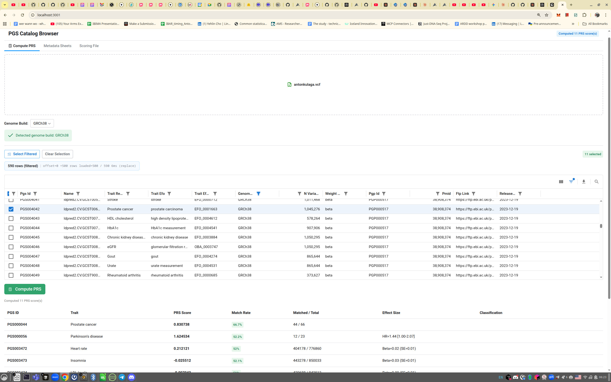

# just-prs

[](https://pypi.org/project/just-prs/)
[](https://pypi.org/project/prs-ui/)
[](https://www.python.org/downloads/)

A [Polars](https://pola.rs/)-bio based tool to compute **Polygenic Risk Scores (PRS)** from the [PGS Catalog](https://www.pgscatalog.org/).

## Project Structure

This is a **uv workspace** with three subprojects:

| Package | Directory | Description |
|---|---|---|
| **just-prs** | `just-prs/` | Core library: PRS computation, PGS Catalog client, VCF normalization, scoring files. Published to PyPI. |
| **prs-ui** | `prs-ui/` | Reflex web UI for interactive PRS computation. Published to PyPI. |
| **prs-pipeline** | `prs-pipeline/` | Dagster pipeline for computing reference distributions from population panels (1000G, HGDP+1kGP). |

The workspace root is a non-published wrapper that depends on all three subprojects and provides convenience scripts (`uv run ui`, `uv run pipeline`).

## Web UI

An interactive [Reflex](https://reflex.dev/) web application for browsing PGS Catalog data and computing PRS scores.



### Setup

```bash
# From the workspace root — install all packages (including prs-ui)
uv sync --all-packages

# Launch the UI (shortcut defined in pyproject.toml)
uv run ui

# Or equivalently, from the prs-ui directory:
cd prs-ui
uv run reflex run
```

The UI opens at http://localhost:3000 with three tabs: **Compute PRS**, **Metadata Sheets**, and **Scoring File**.

### Compute PRS (default tab)

A single workbench with one shared, compact genotype source feeding two selection modes:

1. **Upload a VCF once** — drag-and-drop or browse into the compact source at the top; genome build is auto-detected from `##reference` and `##contig` headers. The VCF is normalized (chr prefix stripped, genotype computed, quality filtered) — normalization is the slow step (shown with an ongoing progress indicator), and a normalized file is cached so re-uploading the same VCF is instant. A collapsed normalized-data preview is available. The same uploaded VCF powers **both** selection modes below. Until a VCF is loaded the score/trait tables are browsable but **read-only** (selection is disabled with an "upload a VCF" prompt).
2. **Pick a mode** — switch between the **Select by PRS** and **Select by Trait** sub-tabs:
   - **Select by PRS** — use checkboxes to pick individual scores (or "Select Filtered"), click **Compute PRS**, and get an **individual** results table: PRS score, AUROC, quality assessment, evaluation population/ancestry, match rate, matched/total variants, and effect sizes. Expand any row for a bell curve, absolute-risk context, and "Ask AI" prompts.
   - **Select by Trait** — pick whole traits grouped from the PGS Catalog (e.g. "type 2 diabetes mellitus" with 32 models). All associated PGS models are computed together and **automatically grouped by trait** — a consensus summary with bell curves, outlier detection, and quality breakdown.
3. **Download CSV** — export computed results via the **CSV** button above the results table.

Per-mode controls (scoring engine, ancestry for percentiles, "Include harmonized scores") and the shared genome-build selector sit above the sub-tabs, so a single upload + build selection applies to both modes.

### Metadata Sheets

Browse all 7 PGS Catalog metadata sheets in a MUI DataGrid with filtering and sorting. Select rows and download their scoring files with **Download Selected**.

### Scoring File

Stream any harmonized scoring file by PGS ID directly from EBI FTP and view it in the grid.

| Environment variable | Default | Description |
|---------------------|---------|-------------|
| `PRS_CACHE_DIR` | OS-dependent (via `platformdirs`) | Root directory for cached metadata and scoring files |

## Features

- **Pure Python alternative to PLINK2** for PRS scoring, genotype extraction, and variant file operations — see [Why not PLINK2?](#why-not-plink2) below
- **`PRSCatalog`** — search scores, compute PRS, look up evaluation performance, and estimate absolute disease risk using cleaned bulk metadata (no REST API calls needed)
- **Absolute disease risk estimation** — converts PRS percentiles into absolute disease probabilities using population prevalence data and published effect sizes. Two mathematical models: OR-per-SD and AUC-bivariate-normal (GenoPred-style). See [methodology](docs/absolute-risk-methodology.md)
- **Disease prevalence data** — 3-tier automated sourcing: hand-curated seed data for ~50 common traits, GWAS Catalog cohort fractions parsed from free-text sample descriptions, and PGS Catalog evaluation cohorts. Consolidated into `trait_prevalence.parquet` and synced to HuggingFace
- **Publication citations** — PRS scores are linked to their source papers with full citations (first author, title, journal, year, DOI)
- **pgen operations** — read `.pgen`, `.pvar.zst`, `.psam` files, extract genotypes, match variants, and score PGS IDs directly in Python via `pgenlib` + polars + numpy
- **Trait-grouped PRS analysis** — select entire traits (e.g. "type 2 diabetes") instead of individual PGS IDs; all associated models are computed and automatically aggregated into a consensus view with bell curves, outlier detection, and quality breakdown
- **Reusable Reflex UI components** — `prs_workbench()` (the whole single-tab By PRS / By Trait layout with a pluggable, detachable genotype source), `vcf_source_section()`, `prs_shared_build_bar()`, `prs_section()`, `trait_summary_table()`, and sub-components (`prs_scores_selector`, `prs_results_table`, etc.) embed in any Reflex app via `PRSComputeStateMixin` and its loose-coupling `load_genotypes(path)` hook. Host apps with their own genotype source can pass a `normalizing=` state var to selectors/compute controls so PRS selection stays locked while their source is still preparing genotypes.
- **VCF normalization** — `normalize_vcf()` strips chr prefix, renames id→rsid, computes genotype from GT, applies configurable quality filters (FILTER, DP, QUAL), warns on chrY for females, and writes zstd-compressed Parquet
- **Quality assessment** — `just_prs.quality` provides pure-logic helpers (`classify_model_quality`, `interpret_prs_result`, `format_effect_size`, `format_classification`) usable from any UI or script
- **CSV export** — download computed PRS results as CSV from the web UI or programmatically
- **Cleanup pipeline** — normalizes genome builds, renames columns to snake_case, parses performance metrics into structured numeric fields
- **Scoring file parquet cache** — `parse_scoring_file()` transparently caches PGS scoring files as zstd-9 compressed parquet with [PGS Catalog spec](https://www.pgscatalog.org/downloads/#dl_ftp_scoring)-driven schema overrides and embedded header metadata, giving 5-60x faster reads and ~17% smaller files than `.txt.gz`
- **Batch reference scoring** — `compute_reference_prs_batch()` scores all ~5,000+ PGS IDs against a reference panel in one call with error tracking, quality flags, and panel-aware output
- **HuggingFace sync** — cleaned metadata, prevalence data, publications, and scoring parquets published to [just-dna-seq/pgs-catalog](https://huggingface.co/datasets/just-dna-seq/pgs-catalog), reference distributions to [just-dna-seq/prs-percentiles](https://huggingface.co/datasets/just-dna-seq/prs-percentiles) — auto-downloaded on first use
- **Bulk download** the entire PGS Catalog metadata (~5,000+ scores) via EBI FTP
- Compute PRS for one or many scores against a VCF file
- All data saved as **Parquet** for fast downstream analysis with Polars
- [Validated against PLINK2](docs/validation.md) — produces identical results (Pearson r = 1.0, relative differences < 5e-7)

## Installation

Requires Python >= 3.13. Uses [uv](https://github.com/astral-sh/uv) for dependency management.

**From PyPI:**

```bash
pip install just-prs
```

**From source (development):**

```bash
git clone https://github.com/antonkulaga/just-prs
cd just-prs
uv sync --all-packages   # installs all three subprojects + dev deps
```

To install only the core library without UI or pipeline: `cd just-prs/just-prs && uv sync`.

The CLI is available as both `just-prs` and `prs`.

### Windows

The web UI and VCF-based PRS computation (the main use case) work on Windows with **no C compiler required**. The reference-panel dependency `pgenlib` is automatically excluded on Windows (via a `sys_platform != 'win32'` marker) because it has no Windows wheels and its bundled C fails to compile with MSVC. So a plain checkout works out of the box:

```bash
cd just-prs
uv sync --all-packages
uv run ui
```

Only the reference-panel / `.pgen` scoring features (`prs reference …`, `prs pgen …`, and the Dagster pipeline) are unavailable on native Windows. If you need those, run them under **WSL** or **Linux**, where `pgenlib` installs from a prebuilt wheel.

## Quick Start

### CLI

```bash
# Compute PRS for a single score
prs compute --vcf sample.vcf.gz --pgs-id PGS000001

# Multiple scores at once
prs compute --vcf sample.vcf.gz --pgs-id PGS000001,PGS000002,PGS000003

# Normalize a VCF to Parquet (strip chr prefix, compute genotype, quality filter)
prs normalize --vcf sample.vcf.gz --pass-filters "PASS,." --min-depth 10

# Search the catalog
prs catalog scores search --term "breast cancer"
```

### Python

```python
import polars as pl
from just_prs import PRSCatalog, normalize_vcf, VcfFilterConfig
from just_prs.prs import compute_prs
from pathlib import Path

catalog = PRSCatalog()

# 1. Normalize VCF to Parquet (recommended as a first step)
config = VcfFilterConfig(pass_filters=["PASS", "."], min_depth=10)
parquet_path = normalize_vcf(Path("sample.vcf.gz"), Path("sample.parquet"), config=config)

# 2. Load as a LazyFrame — memory-efficient, reusable across multiple PRS computations
genotypes_lf = pl.scan_parquet(parquet_path)

# Search for scores
results = catalog.search("type 2 diabetes", genome_build="GRCh38").collect()

# Compute PRS using a LazyFrame (avoids re-reading the VCF for each score)
result = compute_prs(
    vcf_path="sample.vcf.gz",
    scoring_file="PGS000001",
    genome_build="GRCh38",
    genotypes_lf=genotypes_lf,
)
print(f"Score: {result.score:.6f}, Match rate: {result.match_rate:.1%}")

# Batch computation
results = catalog.compute_prs_batch(
    vcf_path=Path("sample.vcf.gz"),
    pgs_ids=["PGS000001", "PGS000002", "PGS000003"],
)

# Look up best evaluation performance for a score
best = catalog.best_performance(pgs_id="PGS000001").collect()
```

## Why not PLINK2?

[PLINK2](https://www.cog-genomics.org/plink/2.0/) is the gold-standard tool for whole-genome association analysis, and its `--score` command is widely used for PRS computation. `just-prs` provides a pure Python alternative that produces **identical results** (validated with Pearson r = 1.0 across 3,202 samples, relative per-sample differences < 5e-7 — see [validation details](docs/validation.md)) while offering several practical advantages:

| | PLINK2 | just-prs |
|---|---|---|
| **Installation** | Platform-specific binary; manual download or conda | `pip install just-prs` — pure Python, works everywhere |
| **Integration** | Shell subprocess with text file I/O | Native Python API — returns polars DataFrames directly |
| **Composability** | Fixed CLI pipeline; parse .sscore/.log outputs | Modular functions: parse variants, read genotypes, match alleles, compute scores — mix and match |
| **Intermediate formats** | Must write temporary score input files | Operates on in-memory DataFrames and numpy arrays |
| **Dependencies** | External binary + system libraries | Only Python packages (pgenlib, polars, numpy) |
| **Debugging** | Parse log files for match stats | Structured Eliot logging with full variant-level visibility |
| **Batch scoring** | One subprocess per PGS ID | Reuses parsed `.pvar` and genotype caches across scores |

The core building blocks — `parse_pvar()`, `parse_psam()`, `read_pgen_genotypes()`, `match_scoring_to_pvar()`, and `compute_reference_prs_polars()` — are all public API and can be used independently for any analysis involving PLINK2 binary format files.

### Quick example: score a PGS against any .pgen dataset

```python
from just_prs import compute_reference_prs_polars
from pathlib import Path

scores_df = compute_reference_prs_polars(
    pgs_id="PGS000001",
    scoring_file=Path("PGS000001_hmPOS_GRCh38.txt.gz"),
    ref_dir=Path("/path/to/pgen_dir"),  # any dir with .pgen/.pvar.zst/.psam
    out_dir=Path("/tmp/output"),
    genome_build="GRCh38",
)
# Returns a polars DataFrame: iid, superpop, population, score, pgs_id
```

```bash
# Or from the CLI:
prs pgen score PGS000001 /path/to/pgen_dir/
prs reference score PGS000001  # single PGS ID against 1000G panel

# Batch score all PGS IDs to build population distributions:
prs reference score-batch                              # all PGS IDs
prs reference score-batch --pgs-ids PGS000001,PGS000002
prs reference score-batch --limit 50 --panel hgdp_1kg  # HGDP+1kGP panel
```

For cross-validation against PLINK2, use `prs reference compare PGS000001` which runs both engines and reports per-sample correlation and timing.

## Embedding PRS UI in Another Reflex App

The PRS computation UI is packaged as reusable [Reflex](https://reflex.dev/) components. Install `prs-ui` (which pulls in `just-prs` automatically), mix `PRSComputeStateMixin` into your state, and feed normalized genotypes through the loose-coupling `load_genotypes(path)` hook. The genotype **source** is detachable — your app supplies its own (a public-genome selector, a consumer-array file, a pre-normalized parquet) and never has to use the bundled VCF upload:

```python
import reflex as rx
from reflex_mui_datagrid import LazyFrameGridMixin
from prs_ui import PRSComputeStateMixin, prs_section


class MyAppState(rx.State):
    genome_build: str = "GRCh38"
    cache_dir: str = ""
    status_message: str = ""


class PRSState(PRSComputeStateMixin, LazyFrameGridMixin, MyAppState):
    """Consumer state — no override needed; load_genotypes is built in."""


def prs_page() -> rx.Component:
    return prs_section(PRSState)


# From your own source handler, push genotypes into the consumer:
#   async def on_genome_ready(self, parquet_path: str):
#       prs = await self.get_state(PRSState)
#       prs.load_genotypes(parquet_path)          # built-in loose-coupling hook
#       for event in prs.set_genome_build("GRCh38"):
#           yield event
```

`load_genotypes(path)` is the loose-coupling contract (it sets `prs_genotypes_path`, rescans the LazyFrame, and clears stale results); you can also call `set_prs_genotypes_lf()` directly with a `pl.scan_parquet()` LazyFrame for memory-efficient, no-re-read computation. For the full single-tab **By PRS / By Trait** experience with your own source, render `prs_workbench(source_section=..., prs_state=..., trait_state=..., mode_state=..., trait_selector=...)`. Individual sub-components (`prs_scores_selector`, `prs_results_table`, `trait_summary_table`, `prs_compute_button`, `prs_progress_section`, `prs_build_selector`, `prs_shared_build_bar`, `vcf_source_section`) can be used independently for custom layouts. `trait_summary_table(state)` groups PRS results by trait and shows consensus bell curves, outlier detection, and quality breakdown — call `state.build_trait_summary()` after computation to populate it.

## Testing

The project includes an extensive integration test suite that runs against real genomic data and external tools -- no mocked data or synthetic fixtures. All tests are reproducible on any Linux, macOS, or Windows machine.

```bash
uv run pytest just-prs/tests/ -v
```

| Test suite | What it validates | Data source |
|---|---|---|
| `test_plink.py` | PRS scores match [PLINK2](https://www.cog-genomics.org/plink/2.0/) `--score` within floating-point precision for 5 GRCh38 scores | Real whole-genome VCF from Zenodo; PLINK2 auto-downloaded |
| `test_percentile.py` | Theoretical mean/SD from allele frequencies, percentile computation, and cross-validation against PLINK2 for 5 scores with allele frequency data | Real PGS scoring files with `allelefrequency_effect` |
| `test_reference_plink2.py` | Reference panel PLINK2 scoring: variant ID construction, allele matching, end-to-end scoring of 4 PGS IDs across 3,202 samples, superpopulation coverage, distribution aggregation | 1000G reference panel + PLINK2 binary (both auto-downloaded) |
| `test_prs.py` | End-to-end PRS computation (single and batch) on a real VCF | Zenodo test VCF |
| `test_cleanup.py` | Full cleanup pipeline: column renaming, genome build normalization, metric string parsing, performance flattening, `PRSCatalog` search/percentile on live catalog data | Real PGS Catalog bulk metadata (~5,000+ scores) via EBI FTP |
| `test_scoring.py` | Scoring file download, parsing, and caching | Real PGS000001 harmonized scoring file |
| `test_scoring_parquet_cache.py` | Parquet cache roundtrip: schema/value fidelity, header metadata preservation, skip-download when cached, PRS equivalence between `.txt.gz` and parquet | 4 real PGS scoring files (PGS000001/2/10/13) + test VCF |
| `test_catalog.py` | REST API client: score lookup, trait search, download URL resolution | Live PGS Catalog REST API |

Key properties of the test suite:

- **PLINK2 cross-validation** — our pgenlib + polars engine produces identical results to PLINK2 `--score` (Pearson r = 1.0 across 3,202 samples, relative per-sample differences < 5e-7). Both VCF-level PRS and reference panel scoring are validated ([details](docs/validation.md))
- **Real data throughout** — test VCF auto-downloaded from Zenodo, PLINK2 binary auto-downloaded for the host platform, scoring files fetched from EBI FTP
- **Percentile verification** — theoretical statistics computed from allele frequencies are validated against manual row-by-row computation, and percentiles are checked for mathematical consistency (CDF symmetry, known quantiles)
- **No mocking** — all tests run real pipelines against real data to catch integration issues

## Documentation

- [CLI Reference](docs/cli.md) — full command-line usage for `prs compute`, `prs normalize`, `prs pgen`, `prs reference`, `prs catalog`, and bulk downloads
- [Python API](docs/python-api.md) — `PRSCatalog`, pgen operations, VCF normalization, reference panel scoring, FTP downloads, REST client, cleanup pipeline, HuggingFace sync
- [Absolute Risk Methodology](docs/absolute-risk-methodology.md) — mathematical models, prevalence data sourcing, confidence tiers, and caveats for converting PRS percentiles to absolute disease risk
- [Dagster Pipelines](docs/dagster.md) — architecture and orchestration of the reference panel and metadata pipelines
- [Validation](docs/validation.md) — accuracy benchmarks against PLINK2 `--score` (individual VCF and reference panel)
- [Cleanup Pipeline](docs/cleanup-pipeline.md) — genome build normalization, column renaming, metric parsing

## Data sources

- PGS Catalog REST API: <https://www.pgscatalog.org/rest/>
- EBI FTP bulk downloads: <https://ftp.ebi.ac.uk/pub/databases/spot/pgs/>
- PGS Catalog download documentation: <https://www.pgscatalog.org/downloads/>
- Cleaned metadata and scoring parquets on HuggingFace: <https://huggingface.co/datasets/just-dna-seq/pgs-catalog>
