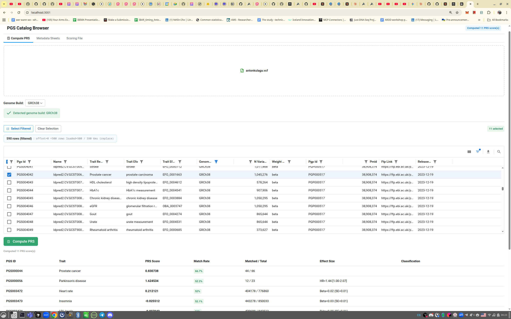
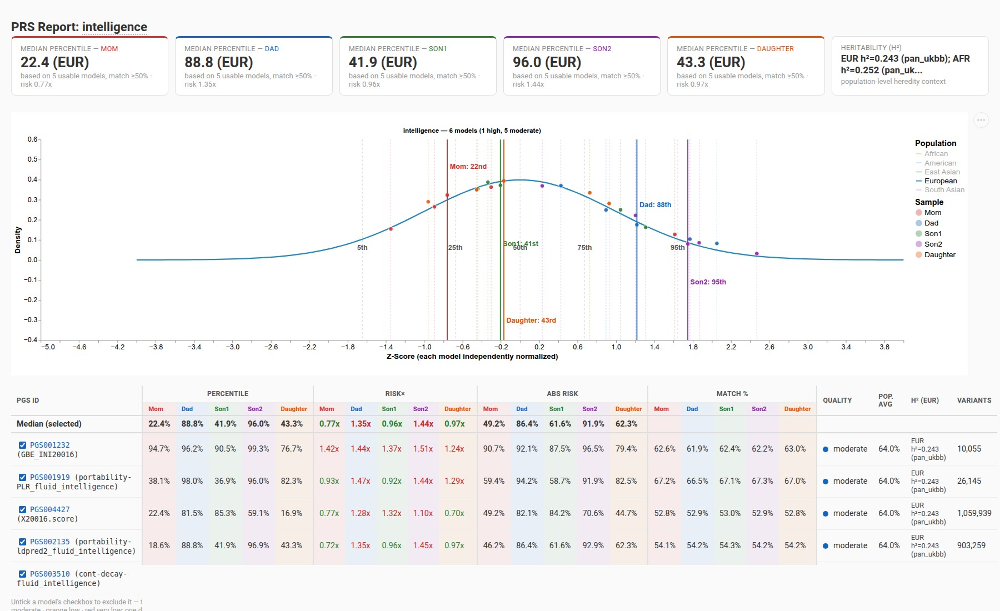

# just-prs: The Polygenic Risk Score (PRS) Toolbox

[](https://pypi.org/project/just-prs/)
[](https://pypi.org/project/prs-ui/)
[](https://www.python.org/downloads/)
[](#research-use-only)
[](#research-use-only)
[](https://github.com/dna-seq/just-prs-mcp)
[](#web-ui)

`just-prs` scores a genome against the **~5,385 published
[PGS Catalog](https://www.pgscatalog.org/) models** (or your own scoring file).
**1000 Genomes percentiles** are precomputed for essentially the full catalog
(a handful of scores are unscorable — HLA / missing coordinates / allele
defects). Sample **population is inferred from 1000G** (super-population plus
closest cohort). SNP heritability (**h²**) is mapped for many traits, and
absolute risk is estimated when the evidence supports it. It is **research
software, not medical advice**.

Most PRS tools either hide the catalog behind one curated score or dump raw
sheets with no guidance. `just-prs` shows **every available model** for a trait,
plus the quality, match-rate, ancestry, and consensus metrics you need to decide
which ones to trust.

Three ways in:

- **Browser** — `uv run ui`, upload a VCF, browse traits, inspect bell curves.
- **Agents** — [just-prs-mcp](https://github.com/dna-seq/just-prs-mcp) for Claude,
  Cursor, Codex, and other MCP clients.
- **CLI / Python** — scripts, notebooks, and pipelines.

## Quick start

```bash
pip install just-prs          # HTML/JSON charts included
pip install "just-prs[viz]"   # optional PNG/SVG export

prs compute --vcf anton --pgs-id PGS000001
prs plot trait BMI --vcf anton -o bmi.html --show-table
```

Built-in aliases `anton` and `livia` auto-download public test genomes from
Zenodo on first use. From this workspace: `uv sync --all-packages` then
`uv run ui` or `uv run prs …`.

Never used this repo? Start with the
[beginner's guide](docs/beginners-guide.md) (install, web UI, MCP, troubleshooting).

## Contents

- [Beginner's guide](docs/beginners-guide.md)
- [Web UI](#web-ui)
- [Agents and slash skill](#agents-and-slash-skill)
- [Visualization](#visualization)
- [CLI and Python](#cli-and-python)
- [Research use only](#research-use-only)
- [Installation](#installation)
- [Documentation](#documentation)

<details>
<summary><strong>Features</strong> — what the toolbox covers</summary>

- **Full PGS Catalog** — ~5,385 published scores. 1000G reference percentiles
  are precomputed for nearly all of them; a handful stay hidden (unscorable or
  quarantined). SNP heritability (h²) is mapped for many traits via Pan-UKBB
  and archival GWAS Atlas.
- **PRS from VCF or consumer arrays** — normalize, score one or many PGS IDs
  (catalog or a local `.txt.gz` / `.parquet`), inspect match rates, quality
  labels, percentiles, and absolute-risk context.
- **1000G ancestry** — infer the sample's super-population and closest 1000G
  cohort; that call drives which reference curve the percentile sits on.
- **Trait-first analysis** — pick a trait such as type 2 diabetes; compute all
  associated models and summarize agreement, outliers, and quality.
- **PGS Catalog metadata** — search cleaned score, trait, performance,
  publication, prevalence, heritability, and scoring-file sheets.
- **Fast data engine** — Polars and DuckDB scoring, zstd Parquet caches,
  HuggingFace sync for cleaned metadata, 1000G percentiles, and h² tables.
- **Reference and pgen workflows** — optional Linux/WSL `.pgen` / 1000G /
  HGDP+1kGP scoring and PLINK2 cross-validation.
- **Reusable UI components** — embed the workbench in another Reflex app via
  `PRSComputeStateMixin` and `load_genotypes(path)`.

</details>

## Web UI



```bash
uv sync --all-packages
uv run ui    # http://localhost:3000
```

Upload a VCF once (or drop several for a family comparison). The app detects
build, normalizes to Parquet, and feeds both **Select by PRS** and **Select by
Trait**. Ancestry is inferred after upload and used as the default reference
population.

<details>
<summary>Workbench tabs and compute flow</summary>

Tabs: **Compute PRS** (default), **Metadata Sheets**, **Scoring File**.

1. Upload a VCF — build detection, normalization, cached Parquet, shared across
   both selection modes.
2. Select by PRS or by Trait — individual PGS IDs, or a whole trait aggregated
   into a consensus summary.
3. Download CSV from the results table.

The metadata and scoring-file tabs browse PGS Catalog sheets and stream
harmonized scoring files by PGS ID.

</details>

## Agents and slash skill

The MCP server is
[`just-prs-mcp`](https://github.com/dna-seq/just-prs-mcp). Ask in plain language:
*"Download Anton's sample genome, normalize it, and compute PRS for type 2
diabetes."*
Step-by-step Cursor / Claude / Codex setup and MCP troubleshooting:
[beginner's guide — MCP](docs/beginners-guide.md#6-deploy-mcp-talk-to-just-prs-from-an-ai-assistant).

<details>
<summary>Claude Code, Cursor, Codex, Antigravity</summary>

**Claude Code:**

```bash
claude mcp add just-prs -- uvx just-prs-mcp@latest stdio
```

**Cursor** (`.cursor/mcp.json` or user MCP config):

```json
{
  "mcpServers": {
    "just-prs": {
      "command": "uvx",
      "args": ["just-prs-mcp@latest", "stdio"],
      "env": {
        "PRS_MCP_MODE": "essentials"
      }
    }
  }
}
```

**Codex:**

```toml
[mcp_servers.just-prs]
command = "uvx"
args = ["just-prs-mcp@latest", "stdio"]
```

**Antigravity** (and other MCP clients): `uvx just-prs-mcp@latest stdio`.

</details>

<details>
<summary>Claude Code plugin: <code>/prs</code>, <code>/curate-trait</code>, <code>/curate-papers</code> (no MCP required)</summary>

This repo is a Claude Code plugin marketplace with one plugin, `just-prs`
([`plugins/just-prs/`](plugins/just-prs/)):

```
/plugin marketplace add dna-seq/just-prs
/plugin install just-prs@just-dna-seq
```

- **`/prs`**: search the catalog, compute scores, make Altair charts, and interpret the
  results through `uvx just-prs`. For example `/prs BMI` or `/prs type 2 diabetes`.
- **`/curate-traits top 10`**, **`/curate-trait longevity`** and **`/curate-papers explore`** (contributors): record what a
  *higher* score means and group scores by meaning rather than by ontology term. They drive
  `prs curation`, a low-effort Opus lookup agent (`score-lookup`), and the rules in
  [`docs/curation-rules.md`](docs/curation-rules.md). Run them from a clone of this repo, since
  the curated files live in [`curation/`](curation/). Design:
  [`docs/score-annotation-plan.md`](docs/score-annotation-plan.md).

Working on the plugin itself: `claude --plugin-dir ./plugins/just-prs`. A clone of this repo
also picks the skills up without installing, through the symlinks in the ignored `.claude/`:

```bash
mkdir -p .claude/skills/{prs,curate-papers,curate-trait,curate-traits} .claude/agents
for s in prs curate-papers curate-trait curate-traits; do
  ln -sfn ../../../plugins/just-prs/skills/$s/SKILL.md .claude/skills/$s/SKILL.md
done
for a in score-lookup trait-curator; do
  ln -sfn ../../plugins/just-prs/agents/$a.md .claude/agents/$a.md
done
```

Only `/prs`, without the plugin:

```bash
mkdir -p ~/.claude/skills/prs
curl -o ~/.claude/skills/prs/SKILL.md \
  https://raw.githubusercontent.com/dna-seq/just-prs/main/plugins/just-prs/skills/prs/SKILL.md
```

Use the skills for interactive sessions; use MCP when you need typed tool schemas.

</details>

## Visualization

Altair charts are built in. HTML (interactive) and JSON (Vega-Lite) work out of
the box; `just-prs[viz]` adds PNG/SVG. `plot trait` auto-detects each sample's
ancestry unless you pass `--ancestry`. `--reference-restoration` is the same
`off` / `wgs` / chip-id flag as `prs compute` (default `off` — see
[reference restoration](docs/reference-restoration.md)). Results are
cached per VCF × PGS ID × build × ancestry × restoration.

<details>
<summary><code>prs plot</code> commands</summary>

```bash
prs plot trait "type 1 diabetes" --vcf livia -o t1d.html --show-table
prs plot trait BMI --vcf anton -o bmi.html --show-table
prs plot trait thrombosis --vcf anton -o dvt.html --fuzzy --show-table

# Overlay population curves
prs plot trait BMI --vcf anton -o bmi.html --show-table --all-ancestries
prs plot trait BMI --vcf anton -o bmi.html --ancestries EUR,AFR,EAS

# Specific PGS IDs (full trait-style report)
prs plot trait PGS000001 --vcf anton -o pgs1.html
prs plot trait PGS000001,PGS000002 --vcf anton -o two_scores.html

# Minimal single-score charts
prs plot bell-curve PGS000001 --vcf anton -o bell.html
prs plot multi-ancestry PGS000001 --vcf livia -o multi.html

# From pre-computed JSON
prs plot trait "type 2 diabetes" -o t2d.html --results my_results.json
prs plot strip results.json -o strip.html --title "My PRS Report"

prs plot trait BMI --vcf anton -o bmi.html --no-cache   # force recompute
prs plot trait intelligence --vcf anton --reference-restoration wgs -o compare.html
```

Format follows the file extension (`.html`, `.json`, `.png`, `.svg`). Trait
matching uses the UI EFO label (e.g. `intelligence`) first, then the catalog
reported name; `--fuzzy` is only needed when a substring hits several traits.
The `plot trait` positional also accepts comma-separated PGS IDs.

</details>

<details>
<summary>AI prompts for agents (<code>prs prompt</code>)</summary>

The Compute UI's Ask Claude / ChatGPT / … buttons are also a CLI. Progress
goes to stderr; the prompt itself is stdout, so you can pipe it into an agent.

```bash
# Multi-sample comparison prompt (same text the HTML Ask-AI buttons prefill)
prs prompt intelligence --vcf Anton=anton --vcf Livia=livia

# Pipe into an agent
prs prompt BMI --vcf anton | claude

# Already-computed JSON ({sample: [rows]} or a list with a sample field)
prs prompt intelligence --results family.json -o prompt.txt

# Prefill URL instead of prompt text
prs prompt PGS000001 --vcf anton --assistant claude --url
```

`--assistant other` (the default) uses the full 6000-character budget with no
URL encoding. `--assistant claude|chatgpt|perplexity|grok` matches that
assistant's UI character limit. Repeat `--vcf` with `Label=path` the same way
as `plot trait`.

</details>

<details>
<summary>Multi-sample / family comparison</summary>

Repeat `--vcf` with optional `Label=path` (aliases work: `Anton=anton`). Each
sample gets its own color, dots, and median line. Ancestry is detected per
genome, so mixed-ancestry families compare correctly. The intelligence
screenshot under [Research use only](#research-use-only) is the example family
(Mom, Dad, Son1, Son2, Daughter).

```bash
prs plot trait intelligence --vcf Anton=anton --vcf Livia=livia -o compare.html

prs plot trait intelligence \
  --vcf Mom=mom.vcf.gz --vcf Dad=dad.vcf.gz \
  --vcf Son1=son1.vcf --vcf Son2=son2.vcf --vcf Daughter=daughter.vcf \
  -o intel_o_family.html

prs plot trait PGS000001 --vcf Anton=anton --vcf Livia=livia -o pgs1_compare.html
prs plot bell-curve PGS000001 --vcf Anton=anton --vcf Livia=livia -o bell_compare.html
```

The web UI does the same: drop several VCFs, get colored sample chips, and
overlay percentiles on every bell curve.

</details>

<details>
<summary>Python API (<code>just_prs.viz</code>)</summary>

| Function | What it shows |
|----------|--------------|
| `plot_prs_bell_curve` | One model + ancestry, user score marker |
| `plot_prs_multi_ancestry` | Five population curves + user score |
| `plot_trait_scores` | Trait-grouped N(0,1) curve + quality-colored model dots |
| `plot_prs_percentile_strip` | Horizontal risk-band strip |

```python
from pathlib import Path
import polars as pl
from just_prs.viz import plot_trait_scores, save_chart

dists = pl.read_parquet("~/.cache/just-prs/percentiles/1000g_distributions.parquet")
quality = pl.read_parquet("~/.cache/just-prs/percentiles/1000g_quality.parquet")

chart = plot_trait_scores(
    "BMI", dists, quality_df=quality,
    user_results=my_results,
    height=150, show_table=True,
)
save_chart(chart, Path("bmi_report.html"))
save_chart(chart, Path("bmi_report.png"))
```

</details>

## CLI and Python

```bash
prs compute --vcf sample.vcf.gz --pgs-id PGS000001
prs compute --vcf sample.vcf.gz --pgs-id PGS000001,PGS000002,PGS000003
prs compute --vcf anton --pgs-id PGS000001,PGS000002 --ancestry --ancestry-aadr
prs compute --vcf sample.vcf.gz --scoring-file my_custom_score.txt.gz
prs normalize --vcf sample.vcf.gz --pass-filters "PASS,." --min-depth 10
prs catalog scores search --term "breast cancer"
```

<details>
<summary>Python scoring snippet</summary>

```python
import polars as pl
from pathlib import Path
from just_prs import PRSCatalog, VcfFilterConfig, normalize_vcf
from just_prs.prs import compute_prs

catalog = PRSCatalog()
config = VcfFilterConfig(pass_filters=["PASS", "."], min_depth=10)
parquet_path = normalize_vcf(Path("sample.vcf.gz"), Path("sample.parquet"), config=config)
genotypes_lf = pl.scan_parquet(parquet_path)

result = compute_prs(
    vcf_path="sample.vcf.gz",
    scoring_file="PGS000001",
    genome_build="GRCh38",
    genotypes_lf=genotypes_lf,
)
print(f"Score: {result.score:.6f}, Match rate: {result.match_rate:.1%}")
```

Full command reference: [docs/cli.md](docs/cli.md). Python API:
[docs/python-api.md](docs/python-api.md).

</details>

<details>
<summary>VCF aliases and public test genomes</summary>

`--vcf` accepts a path or an alias (`compute`, `plot bell-curve`,
`plot multi-ancestry`, `plot trait`). Built-ins auto-download from Zenodo:

| Alias | File | License | Zenodo |
|-------|------|---------|--------|
| `anton` | `antonkulaga.vcf` (~482 MB) | CC0 | [18370498](https://zenodo.org/records/18370498) |
| `livia` | `SIMHIFQTILQ.hard-filtered.vcf.gz` (~349 MB) | CC-BY-4.0 | [19487816](https://zenodo.org/records/19487816) |

```bash
prs alias list
prs alias set mygenome /path/to/my/sample.vcf.gz
prs alias remove mygenome
prs compute --vcf anton --pgs-id PGS000001
```

User aliases live in `~/.cache/just-prs/vcf_aliases.json`. MCP agents can fetch
either genome with `download_sample_genome` (`sample="anton"` or `"livia"`).

</details>

<details>
<summary>Genetic ancestry inference</summary>

Runtime is pure Python (no plink2). Models are built offline and pulled from
HuggingFace on first use.

```bash
prs ancestry infer --vcf anton
prs ancestry infer --vcf anton --mode label --panel 1000g
prs ancestry infer --vcf anton --mode mixture --panel hgdp_1kg
prs ancestry infer --vcf anton --panel hgdp_1kg --resolution population
prs ancestry infer --vcf newton --mode all --prive --aadr --resolution population
prs ancestry check PGS000001 --vcf anton
```

Modes: `label`, `mixture`, `prive`, `consensus`, `all` (default). Panels
`1000g` and `hgdp_1kg` are on HuggingFace; `prive` and `aadr_ho` are built
locally because of data-license terms.

Within-continent calls are best read as **soft proportions**, not a single hard
label — East-Slavic groups form roughly one autosomal cluster. Methodology:
[docs/sample-ancestry-methodology.md](docs/sample-ancestry-methodology.md).

</details>

## Research use only

PRS is a statistical predisposition signal in a studied population — not a
diagnosis, not a probability you “will get” a disease, and not a substitute for
clinical testing.



This is the example family from `prs plot trait intelligence` with five VCFs
labeled Mom, Dad, Son1, Son2, and Daughter. Each person has a median card and
colored markers on the same bell curve. Relatives can sit far apart, and the
models for this trait still disagree — read match rate and quality, not one
percentile. A family PRS plot is not a diagnosis and not a relatedness test.

<details>
<summary>FAQ — quality, ancestry, coverage, absolute risk</summary>

**What does "research use only" mean?** Many people are used to tests that look
at a narrow, high-confidence question (a known pathogenic variant). PRS are
statistical models from many small associations, often with modest predictive
power. Being in the PGS Catalog does **not** mean a score is clinically ready,
ancestry-portable, or useful for an individual decision.

**Why do several PRS for the same trait disagree?** Different cohorts,
ancestries, phenotype definitions, builds, variant sets, and methods. Prefer
better published metrics, higher match rates, relevant ancestry, and agreement
among high-quality models. The trait summary is built to show consensus and
outliers.

**Does a high PRS mean I will get a disease?** No. Heritability for most common
diseases is moderate; current GWAS-based PRS typically capture only a fraction
of it. Tag SNPs in LD with causal loci are not a mechanistic readout. Environment,
age, sex, lifestyle, and chance often matter as much or more.

**Why does ancestry matter?** LD patterns and allele frequencies differ across
populations, so a score trained mostly in Europeans often transfers poorly.
Reference percentiles (“where does this sit vs this panel?”) do not prove the
original model works equally well in that population.

**Why is my match rate so low?** Consumer arrays type ~600–700k SNPs, not a
whole genome. Exomes miss non-coding GWAS tags. Build mismatch matches ~0
variants. `just-prs` can recover some untyped sites via LD-proxy substitution
on GSA v3 / GRCh38 (`1000g`); that lifts coverage but does not replace
imputation. A 12% match is a fragment of the model — check matched vs total
before trusting a number.

**How is quality determined?** A synthetic 0–100 score from published
discrimination (AUROC / C-index / beta / OR), cohort size, match rate, and a
harmonized-liftover penalty, then a combined score after computation on real
genomes. Details: [docs/prs-quality-score.md](docs/prs-quality-score.md).

**What does absolute risk mean?** A conversion from percentile + prevalence +
published performance into a probability. It is only as good as those inputs;
weak evidence should show as N/A, not a precise-looking number. See
[docs/absolute-risk-methodology.md](docs/absolute-risk-methodology.md).

</details>

## Installation

Requires Python >= 3.13. Uses [uv](https://github.com/astral-sh/uv).
First time on a new machine: [beginner's guide](docs/beginners-guide.md).

```bash
pip install just-prs

git clone https://github.com/antonkulaga/just-prs
cd just-prs
uv sync --all-packages
```

CLI names: `just-prs` and `prs`. Core library only:
`cd just-prs/just-prs && uv sync`.

<details>
<summary>Windows</summary>

The web UI and VCF-based PRS work on Windows with **no C compiler**. `pgenlib`
is excluded via `sys_platform != 'win32'` (no Windows wheels; bundled C fails
on MSVC).

```bash
cd just-prs
uv sync --all-packages
uv run ui
```

Reference-panel / `.pgen` scoring (`prs reference`, `prs pgen`, the Dagster
pipeline) needs **WSL or Linux**.

</details>

<details>
<summary>Project structure</summary>

uv workspace with three packages:

| Package | Directory | Description |
|---|---|---|
| **just-prs** | `just-prs/` | Core library. Published to PyPI. |
| **prs-ui** | `prs-ui/` | Reflex web UI. Published to PyPI. |
| **prs-pipeline** | `prs-pipeline/` | Dagster pipeline for reference distributions. |

The workspace root is a non-published wrapper (`uv run ui`, `uv run pipeline`).

</details>

<details>
<summary>Why not PLINK2?</summary>

[PLINK2](https://www.cog-genomics.org/plink/2.0/) `--score` is the gold standard.
`just-prs` matches it (Pearson r = 1.0 across 3,202 samples, relative per-sample
differences &lt; 5e-7 — [docs/validation.md](docs/validation.md)) and is easier
to compose in Python.

| | PLINK2 | just-prs |
|---|---|---|
| **Install** | Platform binary | `pip install just-prs` |
| **Integration** | Subprocess + text I/O | Polars DataFrames |
| **Batch** | One process per PGS ID | Reuses parsed `.pvar` / genotype caches |

```python
from pathlib import Path
from just_prs import compute_reference_prs_polars

scores_df = compute_reference_prs_polars(
    pgs_id="PGS000001",
    scoring_file=Path("PGS000001_hmPOS_GRCh38.txt.gz"),
    ref_dir=Path("path/to/pgen_dir"),
    out_dir=Path("data/output/results/pgs000001"),
    genome_build="GRCh38",
)
```

```bash
prs pgen score PGS000001 path/to/pgen_dir/
prs reference score PGS000001
prs reference score-batch
prs reference compare PGS000001
```

</details>

<details>
<summary>Embed the PRS UI in another Reflex app</summary>

Install `prs-ui`, mix in `PRSComputeStateMixin`, and push genotypes through
`load_genotypes(path)` — your app supplies the source.

```python
import reflex as rx
from reflex_mui_datagrid import LazyFrameGridMixin
from prs_ui import PRSComputeStateMixin, prs_section


class MyAppState(rx.State):
    genome_build: str = "GRCh38"
    cache_dir: str = ""
    status_message: str = ""


class PRSState(PRSComputeStateMixin, LazyFrameGridMixin, MyAppState):
    """Consumer state — load_genotypes is built in."""


def prs_page() -> rx.Component:
    return prs_section(PRSState)
```

For the full By PRS / By Trait workbench with your own source, render
`prs_workbench(...)`. See AGENTS.md for the embedding contract.

</details>

<details>
<summary>Testing</summary>

```bash
uv run pytest just-prs/tests/ -v
```

Integration tests use real genomic data (no mocks). PLINK2 cross-validation,
live catalog metadata, and Zenodo test VCFs are documented in
[docs/validation.md](docs/validation.md).

</details>

## Documentation

- [Beginner's guide](docs/beginners-guide.md) — install, web UI, MCP, troubleshooting
- [CLI Reference](docs/cli.md)
- [Python API](docs/python-api.md)
- [Absolute Risk Methodology](docs/absolute-risk-methodology.md)
- [Dagster Pipelines](docs/dagster.md)
- [Validation](docs/validation.md)
- [Cleanup Pipeline](docs/cleanup-pipeline.md)
- [PRS quality score](docs/prs-quality-score.md)
- [Sample ancestry methodology](docs/sample-ancestry-methodology.md)
- [Reference restoration](docs/reference-restoration.md) (why default is off; gVCF is never filled)

**Data sources:** [PGS Catalog REST](https://www.pgscatalog.org/rest/) ·
[EBI FTP](https://ftp.ebi.ac.uk/pub/databases/spot/pgs/) ·
[HuggingFace pgs-catalog](https://huggingface.co/datasets/just-dna-seq/pgs-catalog) ·
[HuggingFace prs-percentiles](https://huggingface.co/datasets/just-dna-seq/prs-percentiles)
